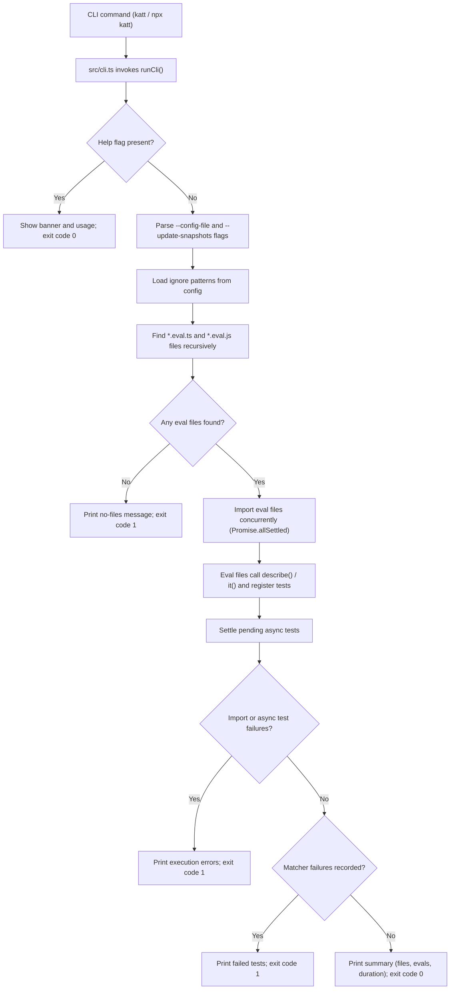
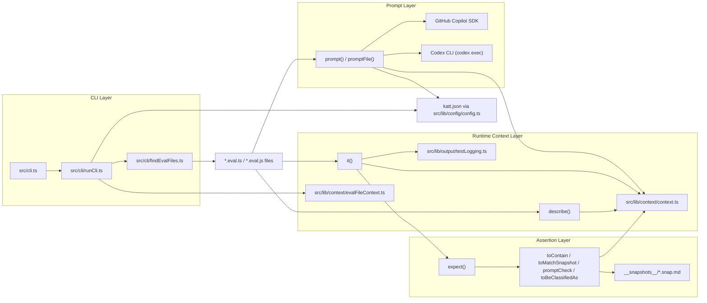

# Katt
[](https://github.com/raphaelpor/katt/blob/main/LICENSE) [](https://www.npmjs.com/package/katt)

Katt is a lightweight testing framework for running AI Evals, inspired by [Jest](https://github.com/jestjs/jest).


## Table of Contents

- [Overview](#overview)
- [API Documentation](#api-documentation)
- [Articles](#articles)
- [Hello World - Example](#hello-world---example)
- [Main Features](#main-features)
- [Installation](#installation)
- [Basic Usage](#basic-usage)
- [Specifying AI Models](#specifying-ai-models)
- [Development](#development)
- [How It Works](#how-it-works)
- [Execution Flow](#execution-flow)
- [Architecture](#architecture)
- [Requirements](#requirements)
- [License](#license)
- [Contributing](#contributing)

## Overview

#### ✨ Run your own benchmarks and evaluations ✨
**Katt** is designed to evaluate and validate the behavior of AI agents like **Claude Code**, **GitHub Copilot**, **OpenAI Codex** and more. It provides a simple, intuitive API for writing tests that interact with AI models and assert their responses.

## API Documentation

For a complete list of features and usage examples, see [docs/api-documentation.md](https://github.com/raphaelpor/katt/blob/main/docs/api-documentation.md).

## Articles

- [Introducing Katt](https://github.com/raphaelpor/katt/blob/main/docs/articles/introduction-to-katt.md)

## Hello World - Example

```typescript
import { expect, prompt } from "katt";

const result = await prompt("If you read this just say 'hello world'");
expect(result).toContain("hello world");
```

It also supports the familiar `describe` and `it` syntax for organizing tests:

```typescript
import { describe, expect, it, prompt } from "katt";

describe("Greeting agent", () => {
  it("should say hello world", async () => {
    const result = await prompt("If you read this just say 'hello world'");
    expect(result).toContain("hello world");
  });
});
```

## Main Features

- **Simple Testing API**: Familiar `describe` and `it` syntax for organizing tests
- **AI Interaction and Verification**: Built-in `prompt()`, `promptFile()` and `promptCheck()` functions for running and analyzing prompts to AI agents
- **Classification Matcher**: Built-in `toBeClassifiedAs()` matcher to grade a response against a target label on a 1-5 scale
- **Concurrent Execution**: Runs eval files concurrently for faster test execution
- **Model Selection**: Support for specifying custom AI models
- **Runtime Selection**: Run prompts through GitHub Copilot (default) or Codex
- **Configurable Timeouts**: Override prompt wait time per test or via `katt.json`

## Usage

### Installation

```bash
npm install -g katt
```

### Basic Usage

1. Create a file with the `.eval.ts` or `.eval.js` extension and write your tests.
```typescript
import { expect, prompt } from "katt";

const result = await prompt("If you read this just say 'hello world'");
expect(result).toContain("hello world");
```

2. Run Katt from your project directory:

```bash
npx katt
```

### Using promptFile

Load prompts from external files:

```javascript
// test.eval.js
import { describe, expect, it, promptFile } from "katt";

describe("Working with files", () => {
  it("should load the file and respond", async () => {
    const result = await promptFile("./myPrompt.md");
    expect(result).toContain("expected response");
  });
});
```

### Specifying AI Models

You can specify a custom model for your prompts:

```javascript
import { describe, expect, it, prompt } from "katt";

describe("Model selection", () => {
  it("should use a specific model", async () => {
    const promptString = "You are a helpful agent. Say hi and ask what you could help the user with.";
    const result = await prompt(promptString, { model: "gpt-5.2" });

    expect(result).promptCheck("It should be friendly and helpful");
  });
});
```

You can also set runtime defaults in `katt.json`.

Copilot (default runtime):

```json
{
  "agent": "gh-copilot",
  "agentOptions": {
    "model": "gpt-5-mini"
  },
  "prompt": {
    "timeoutMs": 240000
  }
}
```

Codex:

```json
{
  "agent": "codex",
  "agentOptions": {
    "model": "gpt-5-codex",
    "profile": "default",
    "sandbox": "workspace-write"
  },
  "prompt": {
    "timeoutMs": 240000
  }
}
```

When this file exists:

- Supported agents are:
  - `gh-copilot` (default when `agent` is missing or unsupported)
  - `codex`
- `prompt("...")` and `promptFile("...")` merge `agentOptions` with call-time options
- `prompt("...", { model: "..." })` overrides the model from config
- `prompt.timeoutMs` sets the default wait timeout for long-running prompts

## Development

### Setup

```bash
npm install
```

### Available Scripts

- `npm run dev` - Run the CLI in development mode
- `npm run build` - Build the project
- `npm run test` - Run tests
- `npm run typecheck` - Run TypeScript type checking
- `npm run format` - Format code using Biome
- `npm run lint` - Lint code using Biome
- `npm run test:build` - Test the built CLI

### Verification Process

After making changes, run the following sequence:

1. `npm run format`
2. `npm run typecheck`
3. `npm run test`
4. `npm run build`
5. `npm run test:build`

## Project Structure

```
katt/
├── src/              # Source code
│   ├── cli/          # CLI implementation
│   ├── lib/          # Core libraries (describe, it, expect, prompt)
│   └── types/        # TypeScript type definitions
├── examples/         # Example eval files
├── specs/            # Markdown specifications
├── package.json      # Package configuration
└── tsconfig.json     # TypeScript configuration
```

## How It Works

Katt runs eval files as executable test programs and coordinates collection, assertion failures, and reporting through its runtime context.

## Execution Flow



1. Katt searches the current directory recursively for `*.eval.js` and `*.eval.ts` files
2. It skips `.git` and `node_modules` directories
3. Found eval files are imported and executed concurrently
4. Tests registered with `describe()` and `it()` are collected and run
5. Each test duration is printed after execution
6. A summary is displayed showing passed/failed tests and total duration
7. Katt exits with code `0` on success or `1` on failure

## Architecture



## Requirements

- Node.js
- For `gh-copilot` runtime: access to GitHub Copilot with a logged-in user
- For `codex` runtime: Codex CLI installed and authenticated (`codex login`)

## License

MIT

## Contributing

We welcome contributions from the community! Please see our [CONTRIBUTING.md](https://github.com/raphaelpor/katt/blob/main/CONTRIBUTING.md) guide for detailed information on how to contribute to Katt.

Quick start:
1. Fork the repository
2. Create a feature branch
3. Make your changes
4. Run the verification process
5. Submit a pull request

For detailed guidelines, development setup, coding standards, and more, check out our [contribution guide](https://github.com/raphaelpor/katt/blob/main/CONTRIBUTING.md).
